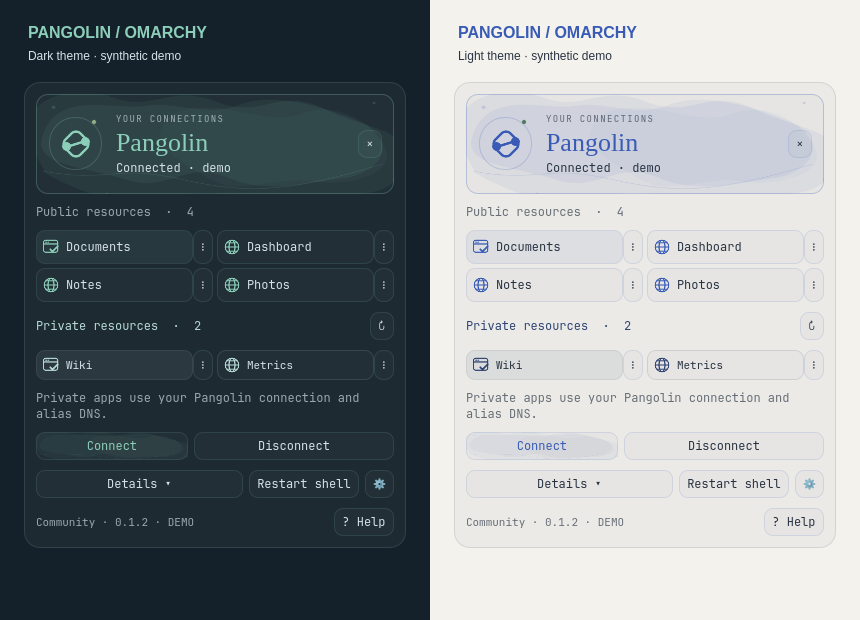
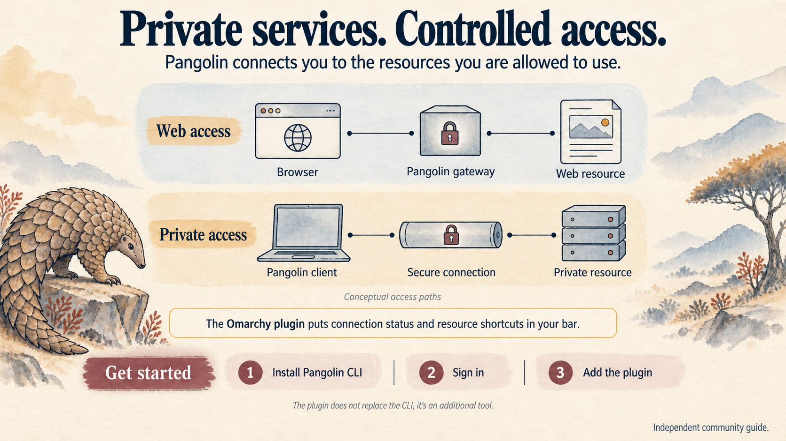

<p align="center">
  <a href="https://patrickisenegger.com"></a>
</p>

# Pangolin for Omarchy

**Your connections, close at hand.** A community bar plugin for Pangolin network connectivity, VPN connection status, proxy resources and web-app shortcuts — painted in your active Omarchy theme.

<p align="center">
  <a href="https://github.com/PatrickIsenegger/omarchy-pangolin/releases/latest"></a>
  <a href="LICENSE"></a>
  <a href="docs/compatibility.md"></a>
  <a href="docs/graphics.md"></a>
</p>

<p align="center">
  <a href="#install">Install</a> ·
  <a href="docs/README.md">User guide</a> ·
  <a href="docs/configuration.md">Configure</a> ·
  <a href="https://github.com/PatrickIsenegger/omarchy-pangolin/releases/latest">Latest release</a> ·
  <a href="README.de.md">Deutsch</a>
</p>



## What Pangolin does

Pangolin provides controlled access to resources on remote networks. Public web resources can be reached through a browser; private resources use a Pangolin client connection. Administrators define the resources and who may access them. The Omarchy plugin adds connection controls and shortcuts to the resources your account can use. [Pangolin's explanation](https://docs.pangolin.net/about/how-pangolin-works).


<details>
<summary>How access works and how to get started</summary>



These are illustrated guides. The screenshot above renders the actual plugin with synthetic data. Follow the [requirements and setup guide](docs/requirements.md) for installation details.

</details>

## A small panel for everyday access

| Connection | Resources | Your desktop |
| --- | --- | --- |
| Connect, disconnect and inspect local tunnel status. | Open public services and compact private-resource tiles. | Install resources as web apps, or open existing matching apps. |
| Green means connected; orange needs attention; red means disconnected or an error. | Copy a web URL or host address with one click. | Text, washes, accents and status colors follow Omarchy. |

The SVG symbol breathes and soft color washes drift only while the panel is open and a fresh connection is confirmed. Closing the panel, disconnecting or losing status stops connection motion. A short resource-icon hover transition adds feedback without a repeating animation. Quiet, readable controls remain available throughout.

**Community release · English interface.** Independent of Pangolin and Omarchy. All screenshots and examples use synthetic resources. The desktop interface uses your theme's colors. [Artwork and rendering](docs/graphics.md).

## Requirements

Omarchy Quattro with the Quickshell plugin API (`Color.popups`, `Ui.Panel`, `KeyboardPanel`), Python 3.10+, and the Pangolin CLI with a readable local OLM socket. Resource discovery requires the launcher API and an existing CLI account. The plugin installer does not install the Pangolin CLI or other system dependencies; see the complete [requirements](docs/requirements.md).

Runtime commands: `python3`, `timeout`, `pangolin`, `omarchy`, `chromium`, `gtk-launch`, `wl-copy`, `xdg-open`, and optionally `notify-send`. The plugin uses Python's standard library; no pip packages are required. See [compatibility](docs/compatibility.md) for the test scope.

## Install

```bash
omarchy plugin add https://github.com/PatrickIsenegger/omarchy-pangolin.git --enable
```

This installs and enables the plugin checkout only. Install the [official Pangolin CLI](https://docs.pangolin.net/manage/clients/install-client), then run `pangolin login` and `pangolin up` separately. Use the [requirements and read-only checks](docs/requirements.md) to verify the local commands and OLM socket.

For a local source checkout:

```bash
omarchy plugin add /path/to/omarchy-pangolin --enable
```

### Pangolin Cloud and self-hosted servers

Both are supported through the active CLI account. For Pangolin Cloud:

```bash
pangolin login
```

For a self-hosted server:

```bash
pangolin login
```

Choose the Cloud or self-hosted server in the CLI login flow.

Select your organization using the CLI. When using several accounts, select the required organization with the CLI (for example, `pangolin select org --org <org-id>`) and reopen the panel to refresh resources. The plugin uses the session API on the selected dashboard host, not the separate integration API at `api.pangolin.net`. You do not need a new integration API key.

Cloud and self-hosted account/request handling are covered by synthetic tests. Authenticated Cloud end-to-end testing still needs a Cloud account.

[Official client endpoint documentation](https://docs.pangolin.net/manage/clients/credentials).

The plugin uses that active account. Connect from the panel; any privilege prompt is handled by Pangolin in a terminal. Nothing connects automatically on installation.

The plugin ID is `community.pangolin`. **Updating an older `patrick.pangolin` installation? Follow the [one-time migration](docs/migration.md) to preserve its position and settings.** Omarchy will not overwrite an existing installation with that ID. Back up an existing custom copy and its configuration before migrating; do not delete it blindly.

## Use

Open or close the enabled plugin panel from a terminal:

```bash
omarchy-shell shell toggle community.pangolin
```

The same command can be assigned to a keyboard shortcut. It opens the panel only; it does not connect or disconnect Pangolin. Omarchy's shell must be running and the plugin enabled.


Resources use a compact single-line layout: a **checked window** identifies an installed app, a **globe** a browser link, and **overlapping sheets** an address-only resource. App tiles have a subtle flat tint; there are no repeated type labels or resource watercolor fills. Hover or focus a resource for its full name, target and requirements.

Left-click a resource to open it (or copy an address-only host). The **⋮ menu**, also available by right-click, contains opening, copying and app installation. **? Help** in the panel opens the [user guide](docs/README.md). Left-click the bar icon to toggle the panel; right-click the bar icon opens the account dashboard.

The icon and header follow the theme accent. Connection dots show green for confirmed connections, orange for pending/unknown states and warnings, and red for disconnected/error states. Semantic colors use the theme palette or matching saturation and lightness when a theme lacks suitable colors.

Private resources need an active Pangolin connection and working alias DNS. A host resource is not necessarily a web service: configure a full URL or a known scheme under [settings](docs/configuration.md). A TCP allowlist alone does not identify HTTP versus HTTPS.

**Restart shell** restarts the entire Omarchy shell, including its bar and other plugins. It does not disconnect the VPN.

## Settings

The gear button opens `$XDG_CONFIG_HOME/omarchy-pangolin/config.json` (default `~/.config/omarchy-pangolin/config.json`). Settings live outside the plugin checkout and survive updates. Overrides are scoped by server and organization. [Configuration reference](docs/configuration.md).

Demo mode uses only generated data and disables actions. Enable the widget's `demo` setting for previews. It never loads account credentials or requests a server.

## Update and remove

```bash
omarchy plugin update community.pangolin
omarchy plugin remove community.pangolin
```

The Omarchy updater follows the repository's default branch, not the newest GitHub Release. `main` is reserved for reviewed release commits. See [releases and rollback](docs/releases.md).

Removal leaves your separately stored settings and installed web apps intact. Remove unwanted apps with `omarchy webapp remove`.

## Privacy and permissions

The plugin runs with your desktop user's permissions. It reads the active CLI account file and uses its session token for HTTPS API calls to that account's server. Tokens are not copied into plugin configuration or printed. Authenticated redirects are rejected. There is no telemetry or external icon download.

Public resources and private resources come from the authorized launcher list. Optional administrative metadata enriches private ports; denied metadata access does not replace or broaden the launcher list. Application probes are not run automatically. Desktop app installation is explicit, with a shared installation lock and filename collision handling.

Do not attach credentials, raw account files, private URLs, or unredacted logs to issues. Use synthetic examples. [Troubleshooting](docs/troubleshooting.md).

## Development

```bash
python3 -m unittest discover -s tests -v
omarchy plugin validate .
```

See [contributing](CONTRIBUTING.md), [changelog](CHANGELOG.md), [license](LICENSE) and [third-party notices](THIRD_PARTY_NOTICES.md).

---

Built by [Patrick Isenegger](https://patrickisenegger.com). Ideas and reproducible issues are welcome — please use fictional resources when sharing examples.
